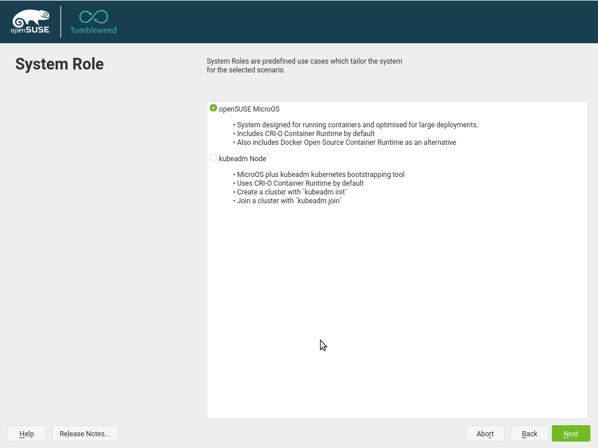
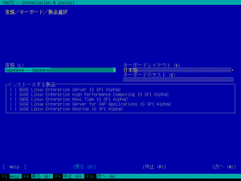
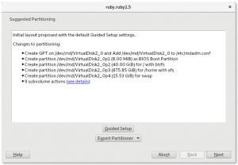
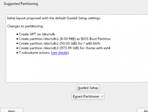
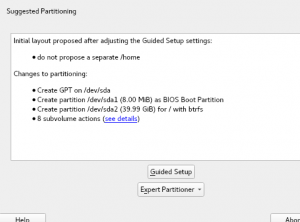
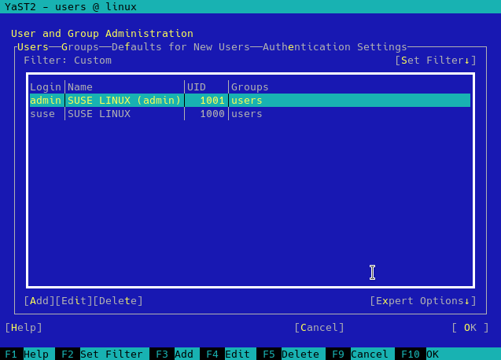

Lumière sur le développement de YaST - Sprint 67
================================================

Le temps passe vite et un autre sprint de développement est terminé pour l'équipe YaST. Au cours de celle-ci, nous nous sommes concentrés sur l'amélioration du processus d'installation, son affinement et l'ajout de nouvelles fonctionnalités afin de libérer de nouvelles possibilités. Cela comprend:

* Plus d'options pour configurer Kubic lors de l'installation.
* Plusieurs améliorations dans la proposition de stockage.
* Faciliter la configuration du réseau et l'utilisation des dépôts en ligne dans openSUSE.
* Amélioration de l’installation en mode texte pour CJK et d’autres langues.
* Configuration de l'accès SSH lors de l'installation et dans un système en cours d'exécution.
* Et beaucoup d'autres petites corrections ici et là!

Nombre de ces fonctionnalités seront déjà disponibles dans openSUSE Tumbleweed en novembre (le sprint s'est terminé le 16 novembre et le processus d'intégration prend généralement quelques jours), d'autres seront visibles pour la première fois dans les prochaines versions de SLE-15-SP1 et Leap 15.1 Alpha.

## Nouveaux dialogues dans l'installation openSUSE Kubic

Les produits [SUSE CaaSP](https://www.suse.com/products/caas-platform/) et [openSUSE Kubic](https://kubic.opensuse.org/) ont reçu un nouveau processus d'installation il y a quelque temps. A l'origine, ils utilisaient un workflow d'installation spécifique (une seule boîte de dialogue de configuration tout-en-un), mais le problème était que de nombreuses fonctionnalités d'installation openSUSE / SLE étaient manquantes car le code du programme d'installation était complètement différent.

Cela a été changé il y a quelque temps pour utiliser l'installation habituelle comme dans les produits standard SLE ou openSUSE. Vous pouvez lire les détails du nouveau processus d'installation sur la page [wiki de Kubic](https://en.opensuse.org/Kubic:CaaSPInstallationComparision#Combined_Workflow).

Cependant, les produits CaaSP ou Kubic nécessitaient des paramètres plus spécifiques en fonction du rôle sélectionné. Pendant ce sprint, nous avons ajouté les étapes correspondantes à l’installation.

Actuellement, la boîte de dialogue supplémentaire ne demande que l'adresse du serveur NTP, mais d'autres options peuvent être ajoutées ultérieurement.

## Amélioration de la prise en charge du mode texte pour CJK et d’autres langues

YaST est capable de gérer de nombreuses langues, même en mode texte. Lorsqu'un utilisateur souhaite exécuter le programme d'installation en mode texte dans certaines langues, telles que le chinois, le japonais ou le coréen, YaST utilise un émulateur de terminal spécial appelé `fbiterm`, capable d'afficher les caractères nécessaires à ces langues.

Désormais, au lieu de conserver deux approches différentes en fonction de la langue, YaST tentera d'utiliser cet émulateur de terminal spécial chaque fois que cela est possible pour toutes les installations basées sur du texte. Malheureusement, il existe un petit ensemble de langues qui ne sont pas correctement gérées par `fbiterm`. Dans ces cas, YaST informera l'utilisateur du problème et celui-ci retombera en anglais.

Suite à cette unification, la police utilisée lors de l’installation du mode texte a changé pour toutes les langues qui n’utilisaient pas `fbiterm` auparavant. Il est donc possible que votre installation de SUSE ou d'openSUSE soit légèrement différente.

## Proposition de stockage: jouer avec la technologie Intel Rapid Start

La technologie [Intel Rapid Start](https://software.intel.com/en-us/articles/what-is-intel-rapid-start-technology) (également appelée IRST) permet aux systèmes de reprendre rapidement leur activité en veille profonde (par exemple, si votre batterie s'épuise) C’est une technologie pilotée par un microprogramme qui repose sur l’existence d’une partition spéciale située sur un SSD (Solid State Device).

Mais notre proposition de partitionnement (appelée *configuration guidée*) n'était pas consciente du rôle important de cette partition. Il a donc parfois été suggéré de la supprimer afin d'utiliser l'espace libéré pour l'installation de SUSE ou openSUSE par dessus.

Nous l'avons amélioré et la partition IRST ne sera supprimée qu'en dernier recours, si la suppression de toutes les autres partitions autorisées sur le disque n'est toujours pas suffisante pour adapter le nouveau système. De plus, une partition IRST située sur le même disque qu'un système Windows ne sera supprimée que si l'utilisateur autorise explicitement la proposition de stockage à supprimer cette installation Windows.

## Exécution de la proposition de stockage sur des RAID logiciels et des périphériques USB

Mais ce n’est pas la seule amélioration apportée dans le domaine de la configuration guidée du partitionnement. Nous avons également élargi son utilité en lui permettant d'être utilisé sur de nouveaux types d'appareils.

Tout d’abord, il est maintenant possible d’exécuter la configuration guidée sur un logiciel MD RAID. Pour cela, les RAIDs candidats doivent remplir l'une des deux conditions suivantes: contenir une table de partition ou être complètement vide (ce qui implique de ne pas être formaté, chiffré ou utilisé à d'autres fins). C’est non seulement une autre étape pour tirer parti de la capacité relativement récente de YaST à partitionner des RAID logiciels (grâce à `libstorage-ng`), mais également un moyen très naturel de prendre en charge l’utilisation des contrôleurs RAID EMC PowerEdge Dell S130 et S140, qui offrent une solution hybride basée sur des RAID logiciels mais sauvegardée par une configuration pilotée par un microprogramme.

Tant qu'à faire, nous avons décidé qu'il était temps d'offrir les périphériques USB disponibles en tant que candidats à la configuration guidée, même s'il existe également des candidats non USB. À l’exclusion, bien sûr, du support d’installation (sauf lorsqu’un réseau est exécuté).
Comme d'habitude, ces fonctionnalités seront bientôt disponibles dans openSUSE Tumbleweed, ainsi que dans les prochaines versions stables d'openSUSE Leap (15.1) et SUSE Linux Enterprise (SLE-15-SP1).

## Ajustement de la proposition de stockage initiale

Toutes les modifications décrites ouvrent de nouvelles possibilités aux utilisateurs pour décider du lieu d'exécution de la proposition de stockage. Mais comme nos utilisateurs le savent déjà, lorsque le programme d'installation atteint l'étape de proposition de stockage pour la première fois (avant que l'utilisateur n'ait eu la chance d'exécuter la configuration guidée ou le partitionneur expert), une proposition initiale est automatiquement calculée et affichée. Cette proposition est exécutée sans intervention de l'utilisateur et toutes les informations nécessaires sont extraites du fichier de contrôle du produit actuel. Par exemple, s'il faut créer une partition `/home` distincte ou activer les instantanés pour `root`, etc.

Lors du sprint précédent, cette proposition initiale avait déjà été améliorée pour tenter d’essayer chaque disque au lieu de considérer tous les disques ensemble. Nous avons maintenant amélioré ce comportement pour ne pas supprimer le premier disque aussitôt, même si cela impliquait d'obtenir un système SUSE ou openSUSE plus petit.

Par exemple, imaginons que nous avons un système avec un premier petit disque SSD de 40 Go et un deuxième grand disque dur de 1 To, ce qui est une configuration relativement courante pour les ordinateurs portables. Comme le premier disque est trop petit pour allouer un système avec les tailles de partition optimales et une partition `/home` distincte, le programme d’installation basculait sur le deuxième disque, dans lequel il pouvait proposer une partition racine de la taille recommandée pour utiliser les instantanés *Btrfs* (50 Go) et une partition pour `/home` supérieure à 40 Go spécifiée comme minimum dans la description du produit.

Maintenant, plusieurs tentatives seront effectuées sur le premier disque avant d'abandonner et de passer au suivant. Ainsi, lorsque la proposition n'est pas possible avec les tailles souhaitées et que tous les périphériques optionnels sont activés, le système essaiera de désactiver certains paramètres facultatifs et d'assouplir les exigences de taille (en utilisant les tailles minimales au lieu des valeurs recommandées). Dans la capture d'écran suivante, vous pouvez voir le résultat de cette proposition initiale ajustée.

## Tumbleweed: Ajouter des dépôts en ligne lors de l'installation

Nous avons ajouté une étape dans le flux de travail d'installation pour activer les dépôts en ligne. Cela signifie que vous pouvez désormais installer immédiatement les derniers packages au cours de l'installation au lieu d'installer les anciennes versions à partir du support d'installation, puis de les mettre à jour ultérieurement vers les dernières versions à partir des serveurs openSUSE.

De plus, en raison des limitations d'espace disque, le support d'installation ne contient pas tous les packages fournis par openSUSE et, par conséquent, pas tous les rôles système. Par exemple, certains des bureaux les moins fréquemment utilisés n'étaient pas disponibles dans la boîte de dialogue de sélection de rôle (anciennement « sélection de bureau »). Avec les dépôts en ligne, ils sont maintenant disponibles immédiatement lors de l'installation.

Pour plus de détails, voir la *[pull request](https://github.com/yast/yast-packager/pull/385)* correspondante.

## Choisir le *backend* du réseau

Voici d’autres modifications de l’installateur dont vous pourrez profiter très prochainement dans openSUSE Tumbleweed et également dans le prochain openSUSE Leap 15.1. Il est maintenant possible de choisir le *backend* de réseau, à savoir *wicked* ou *NetworkManager*, à utiliser dans le système final installé à partir de la proposition de réseau.

Aussi simple qu'un clic sur un lien hypertexte, comme vous pouvez le voir dans les images ci-dessous.

## Gestion des clés publiques SSH

Lorsque vous souhaitez accéder à un système via SSH, il est recommandé d'utiliser une authentification basée sur une clé publique au lieu de l'approche commune basée sur un mot de passe. Pour cette raison, nous avons ajouté la prise en charge permettant de gérer les clés publiques SSH autorisées dans le module de gestion des utilisateurs et des groupes, également appelé module des utilisateurs.

En outre, vous pourrez configurer une clé publique pour l'utilisateur *root* lors de l'installation, ce qui peut s'avérer particulièrement utile pour des produits tels que la plate-forme SUSE CaaS.

## Et ça continue d'avancer!

L’équipe de YaST s’efforce sans relâche de corriger les bogues et, plus particulièrement, de créer de nouvelles fonctionnalités que tous pourront utiliser dans les prochaines versions de tous les produits des familles SLE et openSUSE. Donc, même si nous aimerions continuer à vous parler de toutes les améliorations, il est temps de retourner programmer !
On se revoit dans deux semaines avec un nouveau rapport.
