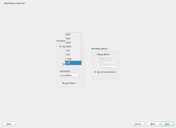
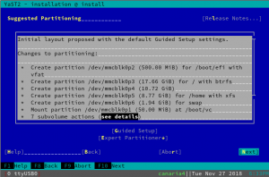
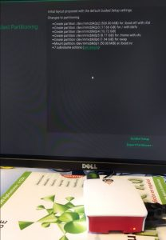

Lumière sur le développement de YaST - Sprint 68
================================================

**Au programme:**

**UDF:** Partagez de gros fichiers avec d'autres systèmes d'exploitation

**Raspberry Pi:** Installation entièrement personnalisée avec YaST

### Prise en charge du système de fichiers UDF

UDF ([Format de disque universel](https://en.wikipedia.org/wiki/Universal_Disk_Format)) est un format de système de fichiers largement utilisé pour les DVD et les formats de disque optique plus récents, remplaçant ainsi la norme ISO 9660. Cette technologie ne se limite pas à la technologie optique. En fait, il peut parfaitement être utilisé sur des périphériques flash tels que des clés USB et des disques durs. UDF est l’un des meilleurs choix lors du transfert de données entre plates-formes. La plupart des systèmes d’exploitation modernes sont déjà compatibles, notamment Windows, BSD, MacOS X, Solaris, OS/2 (eComStation), BeOS (Haiku) et le noyau Linux.

UDF offre plusieurs avantages. L'un d'eux est la prise en charge de très gros fichiers. Avec UDF, vous pouvez créer des fichiers de plusieurs téraoctets, ce qui rend vraiment ridicule la limitation maximale de 4 gigaoctets en VFAT. De plus, UDF possède également la capacité de minimiser l'usure des supports réinscriptibles avec des cycles de réécriture limités, tels que les mémoires flash, CD-RW et DVD-RAM.

YaST commence à prendre en charge les systèmes de fichiers UDF prêts à l'emploi. Le Partitionneur Expert propose désormais l’option UDF lors du formatage d’un périphérique (voir la capture d’écran suivante). Et cela est disponible même pendant l'installation, vous pouvez donc créer un volume au format UDF et le partager entre vos différents systèmes d'exploitation.

### Cliquez simplement sur "Suivant" pour installer openSUSE sur un Raspberry Pi.

Tous ceux qui n'ont pas vécu dans une grotte ces 5 dernières années connaissent les [Raspberry Pi](https://www.raspberrypi.org/). Et quiconque a utilisé l’un de ces périphériques sait que la manière habituelle d’y intégrer un système d’exploitation est différente de celle dont nous avons l'habitude pour d'autres ordinateurs. Au lieu d’installer à partir d’une image ISO standard, en personnalisant toutes les options du processus, Raspberry Pi et des mini-ordinateurs similaires sont généralement chargés avec une image prédéfinie d’un système d’exploitation (spécifique à chaque modèle) téléchargée depuis Internet. Beaucoup de ces systèmes Linux pré-configurés sont conçus pour un usage spécifique et de nombreuses décisions (comme le type de système de fichiers à utiliser) sont déjà prises par ceux qui ont construit l'image.

Mais nous voulions que SLE 15-SP1 et openSUSE Leap 15.1 soient les premiers systèmes d’exploitation polyvalents à prendre en charge une expérience standard complète de Linux dans Raspberry Pi. Aucune image ISO personnalisée à partir de laquelle installer, aucune image pré-configurées à copier, il suffit de prendre l'image ISO SLE non modifiée ou celle d'openSUSE non modifiée et de l'installer comme vous le feriez sur n'importe quel autre ordinateur. Et nous voulions que le processus soit aussi simple que d'appuyer sur "suivant", "suivant", "suivant", "installer". Avec l’installateur détectant et proposant l’ensemble des configurations par défaut qui ont du sens, comme d’habitude.

Le principal défi à cet égard était la structure du partitionnement. Pour pouvoir démarrer, le Raspberry Pi a besoin d’une partition très spécifique contenant le microprogramme du système. Il est donc important que l'installateur détecte une telle partition et la conserve quoi qu'il arrive en la montant dans `/boot/vc` pour permettre au système d'exploitation de mettre à jour le microprogramme. Dans la capture d'écran suivante du processus d'installation réalisée via la console série Raspberry Pi, vous pouvez voir cela en action.

i

La console série est la méthode préférée des experts pour gérer le Raspberry Pi localement. Elle fonctionne immédiatement avec les pré-versions des futures SLE-15-SP1 et Leap 15.1. Mais les utilisateurs moins avancés préféreront probablement effectuer une installation graphique avec un clavier et un écran connectés à l'appareil. Pour que cela fonctionne parfaitement, les arguments suivants doivent être fournis à l'installateur lors du démarrage.

    textmode=0 modprobe.blacklist=vc4

Le deuxième argument empêche la sortie HDMI d'être déconnectée peu de temps après le démarrage de l'ordinateur, ce qui ne se produira que sur certains moniteurs. Cela nous est arrivé lors de nos tests (que vous pouvez voir ci-dessous) et cet argument a corrigé le problème.

Une dernière remarque si vous voulez vous amuser avec ceci : Tenez compte du fait que Raspberry Pi utilise une architecture interne différente de celle des PC habituels. Ainsi, au lieu de l’image x86 du programme d’installation, vous devrez utiliser l’image *aarch64*. L'architecture *aarch64* est officiellement prise en charge par SLE et également disponible pour openSUSE Leap et Tumbleweed en tant que port non officiel.
